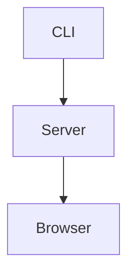

# Comprehensive Document

Intro paragraph with **bold**, _italic_, ~~deleted~~, `inline code`,
[a link](https://example.com), and .

## Lists

- unordered one
- unordered **two**
  - nested unordered
    1. nested ordered

1. ordered one
2. ordered two

- [ ] unchecked task
- [x] checked task

> Quoted **text** with a second line.

---

| Feature | Status | Owner |
| ------- | :----: | ----: |
| Table   |  yes   |     1 |
| Mermaid |  yes   |     2 |

```js
console.log("<escaped>");
```



````md

````

<script>alert("nope")</script>
