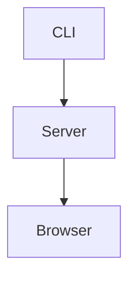

# Comprehensive Document

Intro paragraph with **bold**, _italic_, ~~deleted~~, `inline code`,
[an inline link](https://example.com "Example title"), a reference link to
[the docs][docs], and an inline image .

Second paragraph after inline media to verify paragraph spacing between rich
inline content and the next block.

## Headings And Paragraph Flow

Text before a subheading.

### Subheading Between Paragraphs

Text after a subheading with a plain URL: https://example.com/path?q=1.

#### Deep Heading

Paragraph after a deep heading with escaped punctuation: \*not emphasized\* and
an entity: &copy;.

## Mixed Lists

Text before an unordered list.

- unordered one
- unordered two
  - nested unordered after inline text
  - nested unordered before an ordered list
    1. nested ordered one
    2. nested ordered two
       - deeply nested unordered after ordered text
- unordered three after the nested list

Text between unordered and ordered lists.

1. ordered one
2. ordered two
   1. nested ordered child
   2. nested ordered child with a task list below
      - [ ] nested unchecked task
      - [x] nested checked task
3. ordered three after nested tasks

Text between ordered and task lists.

- [ ] unchecked task
- [x] checked task
- [x] uppercase checked task

Text after task lists.

## Simple Nested Lists

- Parent item before a nested list
  - Nested list first item
  - Nested list second item
- Second parent item after a nested list

Paragraph after simple nested lists.

## Blockquotes Around Other Blocks

Paragraph before a blockquote.

> Quoted **text** with a hard line break.\
> The second quoted line stays in the same quote.
>
> - quoted unordered item
> - quoted unordered item with nested ordered items
>   1. quoted ordered child
>   2. quoted ordered child
>
> Quote paragraph after a list.

Paragraph between blockquote and horizontal rule.

---

Paragraph after the horizontal rule.

## Tables Between Text

Paragraph before a table.

| Feature | Status | Owner |
| ------- | :----: | ----: |
| Table   |  yes   |     1 |
| Mermaid |  yes   |     2 |
| Lists   |  yes   |     3 |

Paragraph after a table before code.

## Code Blocks

Indented code follows this paragraph.

    const indented = "<escaped>";
    console.log(indented);

Paragraph between indented code and fenced code.

```js
console.log("<escaped>");
```

Paragraph between fenced code blocks.

```ts
type PreviewState = "loading" | "ready";
const state: PreviewState = "ready";
```

Paragraph before Mermaid.



Paragraph after Mermaid before nested fences.

````md

````

Paragraph after nested fences.

## Raw HTML And Unsupported Syntax Samples

Raw HTML should be escaped:

<script>alert("nope")</script>

Definition-list-looking text should remain plain paragraphs:

Term : Definition text

Footnote-looking text should remain plain text.[^note]

[^note]: Footnote definitions are not enabled.

Math-looking text should remain plain text: $a^2 + b^2 = c^2$.

## Final Mixed Sequence

Paragraph before final list.

- final unordered item before quote
- final unordered item after quote text

Paragraph between final list and final rule.

---

Final paragraph after final horizontal rule.

[docs]: https://example.com/docs "Docs title"
